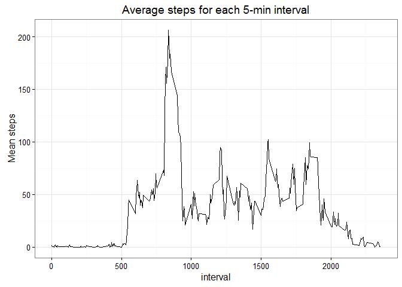
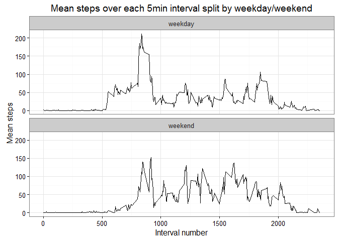

# Reproducible Research: Peer Assessment 1


```r
#Libraries Used
library(ggplot2)
library(plyr)
```

## Loading and preprocessing the data

```r
activity<-read.csv("data/activity.csv",
                   colClasses=c("integer","Date","integer"))

stepsperday<-ddply(activity, 
                   c("date"),
                   summarise,
                   totalsteps=sum(steps,na.rm=TRUE))

stepsper5min<-ddply(activity, 
                    c("interval"),
                    summarise,
                    meansteps = mean(steps,na.rm=TRUE))
```

## What is mean total number of steps taken per day?

Mean total number of steps taken per day is given by 9354.2295082.
Median number of steps taken per day is given by 10395(NA's omitted).


```r
stepshist<-ggplot(stepsperday,aes(x=totalsteps))+geom_histogram()+
  xlab("Total number of steps")+
  ggtitle("Histogram of total steps in one day")+
  theme_bw()
print(stepshist)
```

```
## `stat_bin()` using `bins = 30`. Pick better value with `binwidth`.
```


## What is the average daily activity pattern?

```r
dayline<-ggplot(stepsper5min,aes(x=interval,y=meansteps))+geom_line()+
  ggtitle("Average steps for each 5-min interval")+
  ylab("Mean steps")+
  theme_bw()
print(dayline)
```



Raw points with a loess curve for alternative daily activity pattern visualisation :


```r
dayraw<-ggplot(activity,aes(x=interval,y=steps))+geom_point(alpha=.1)+geom_smooth()+
  ggtitle("Steps in each 5-min interval, raw points + loess curve")+
  theme_bw()
print(dayraw)
```

```
## Warning: Removed 2304 rows containing non-finite values (stat_smooth).
```

```
## Warning: Removed 2304 rows containing missing values (geom_point).
```


Interval #835 with a mean of 206.1698113 steps is the five minute interval with the highest mean step-count.  

## Imputing missing values

2304 incomplete records are unevenly distributed through the data.


```r
hist(which(complete.cases(activity)),
     main="Count of complete cases (chronological order)",
     xlab="Observation number",
     ylab="Count of complete cases"
     )
```


 Using the average of previous valid observations and the next valid observation, or the average of the relevant 5-min interval if there is no valid previous/next observation, interpolation is done which produces smooth activity-over-the-day lines for each individual day, but is not very fast.
 

```r
step_interpolation <- function(rownumber){
  prevrow=rownumber;
  nextrow=rownumber;
  
  while(is.na(activity$steps[prevrow])){
    prevrow = prevrow-1
    
    if(prevrow < 1) return(mean(activity[activity$interval==activity$interval[rownumber],"steps"],na.rm=TRUE))
  }
  
  while(is.na(activity$steps[nextrow])){
    nextrow=nextrow+1
    
    if(nextrow>nrow(activity))return(mean(activity[activity$interval==activity$interval[rownumber],"steps"],na.rm=TRUE))
  }
  
  return(
    (activity$steps[prevrow]+activity$steps[nextrow])/2
  )
}

activity_guessNA <-activity
for(n in 1:nrow(activity)){
  if(is.na(activity$steps[n])){
    activity_guessNA$steps[n]=step_interpolation(n);
  }
}
```
Since, I didn't want to superimpose two histogram, I used density plot and it's similar. The imputed dataset has fewer zeros, the original data is peppered with lone zeros and the imputation strategy above just doesn't reproduce this pattern.


```r
stepsperday2<-merge(
  ddply(activity_guessNA,
        c("date"),
        summarise,
        guesstotalsteps=sum(steps,na.rm=TRUE)
  ),
  stepsperday,
  by="date"
)

guesscheck<-ggplot(stepsperday2,
        aes(x=totalsteps))+
geom_density()+
geom_density(aes(x=guesstotalsteps,color="Imputed"))+
ggtitle("Density plot comparing raw and NA-imputed activity datasets")+
xlab("total steps")+
theme_bw()
print(guesscheck)
```


Here's the histogram :

```r
histogram<-ggplot(stepsperday2,aes(x=guesstotalsteps))+
    geom_histogram()+
  ggtitle("Histogram of total number of steps per day after missing values imputed")+
    theme_bw()
print(histogram)
```

```
## `stat_bin()` using `bins = 30`. Pick better value with `binwidth`.
```


The mean and median total steps are 9354.2295082 and 10395, for the NA-imputed data the mean and median are  9707.219301 and 1.0571\times 10^{4}. 

## Are there differences in activity patterns between weekdays and weekends?

It seems that activity is higher on the weekends, particularly in the middle of the day.


```r
paindays = c("Monday","Tuesday","Wednesday","Thursday","Friday")

activity_guessNA$weekday<-as.factor(ifelse(weekdays(activity_guessNA$date)%in%paindays,"weekday","weekend"))

stepsperinterval.weekdaysplit<-ddply(activity_guessNA, c("interval","weekday"),summarise,
                    meansteps = mean(steps,na.rm=TRUE)
)

weekdayplot<-ggplot(stepsperinterval.weekdaysplit,aes(x=interval,y=meansteps))+
  facet_wrap(~weekday,nrow=2,ncol=1)+
  geom_line()+
  theme_bw()+
  ggtitle("Mean steps over each 5min interval split by weekday/weekend")+
  ylab("Mean steps")+
  xlab("Interval number")
print(weekdayplot)
```


